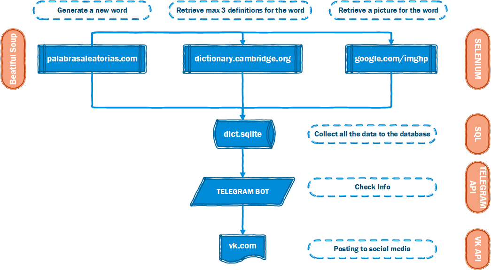

# Description
## How this little project works:

put config.py in "C:\Users" directory with the next info
TOKEN = 'token for your telegram bot'
LOGIN, PASSWORD = 'vk_login', 'vk_password'

py tel.py for launch the bot
